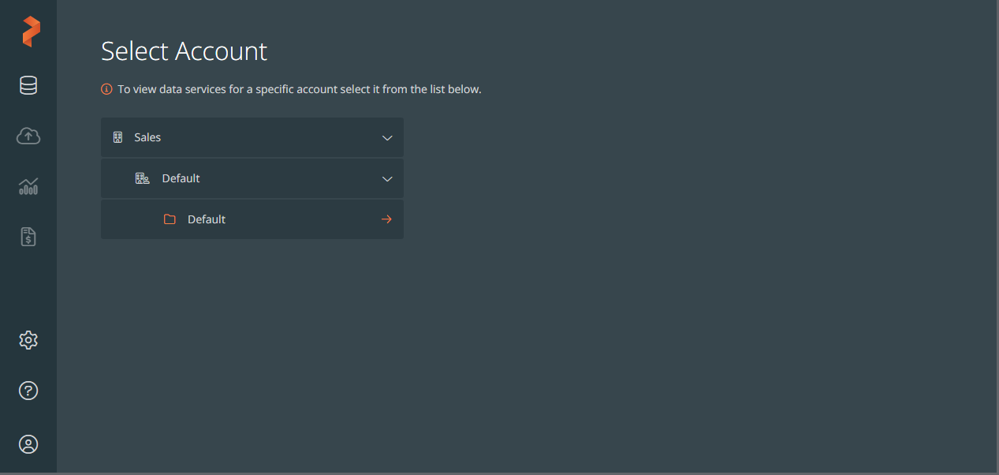

This template leverages PDS API to register the px-deploy created ec2 k8s cluster to PDS, creates a PDS Postgres deployment and runs spring-petlinic application deployment within the same namespace accessing the Postgres DB.

It also creates a script to delete the Postgres deployment and unregisters the cluster from PDS Control plane. (found on master node /assets/pds-petclinic/delete_deployment.sh) 

## contents
.px-deploy/assets/pds-petclinic/

.px-deploy/templates/pds-petclinic.yml

.px-deploy/scripts/pds-petclinic

## getting started
### 1.  Login to PDS 

note your ACCOUNT / TENANT / PROJECT Names (shown at login)
 

create a User API Key

### 2. review and modify px-deploy settings
in `.px-deploy/templates/pds-petclinic.yml`

set PDS_TOKEN to your User API Key

check/set PDS_ACCOUNT / PDS_TENANT / PDS_PROJECT

check/set PDS_ENDPOINT 

### 3. create deployment
`px-deploy create -n nameyourdeployment -t pds-petclinic`

when deployment is finished you should be able to connect to spring-petclinic app using 
http://[external ip]:30333

You can also see the Deployment Target and the Postgres Deployment on PDS

### 4. uninstall
login to master node and run
 
`/assets/pds-petclinic/delete_deployment.sh`

This will remove the postgres DB and k8s cluster from PDS.

Then youre safe to run "px-deploy destroy..."

## known issues / limitations
This template is currently designed for k8s cluster being deployed on aws ec2 instance.

EKS,GKE,OCP are currently not supported

