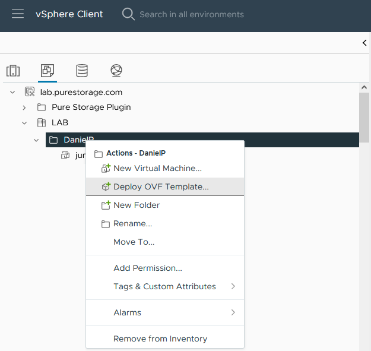
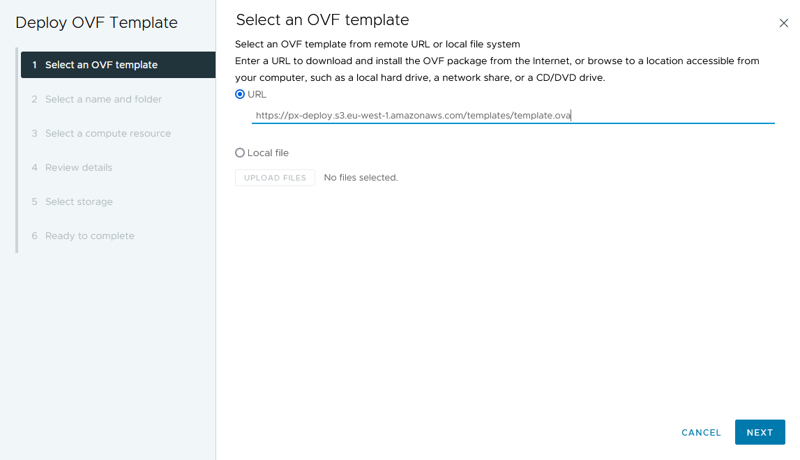
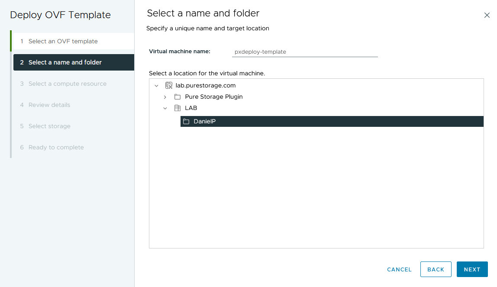
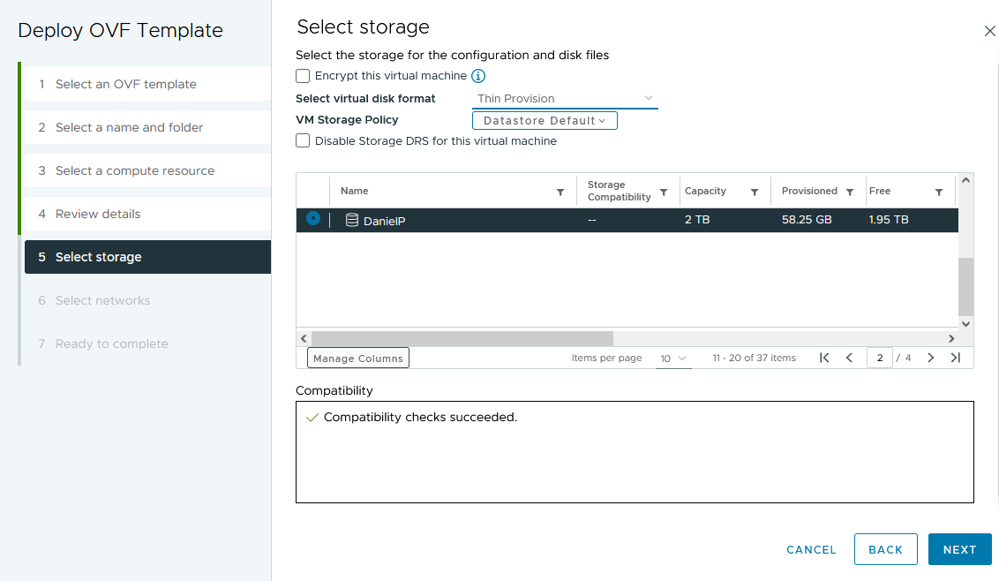
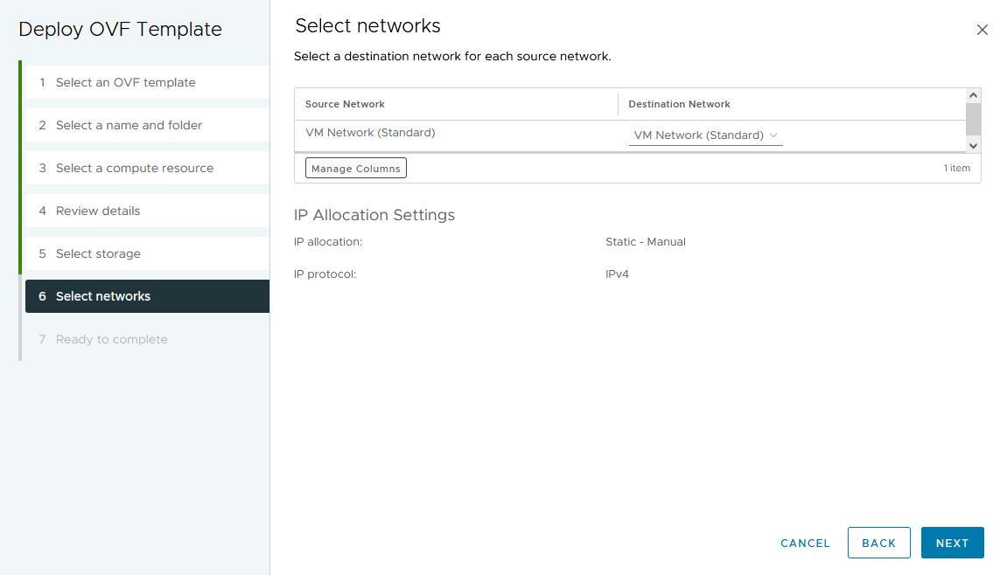
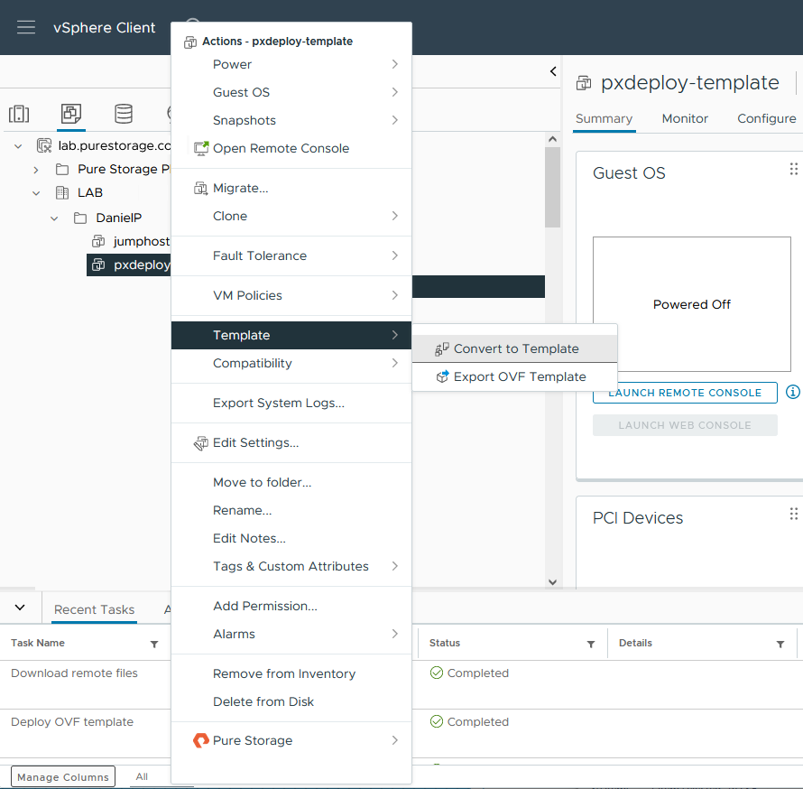

## Manual creation of px-deploy vSphere template

instead of running `px-deploy vsphere-init` it can be faster to create the template using vCenter UI

#### 1. check your `~/.px-deploy/defaults.yml`

take note of the following options (showing example settings here):
- **vsphere_template** (example contains folder part `DanielP`)

 `vsphere_template: "DanielP\pxdeploy-template"`

- **vsphere_datacenter**

`vsphere_datacenter: "LAB"`

- **vsphere_folder**

`vsphere_folder: "DanielP"`

- **vsphere_resource_pool**

`vsphere_resource_pool: "DanielP"`

- **vsphere_datastore**

`vsphere_datastore: "DanielP"`

#### 2. Login to vCenter UI

A) if **vsphere_template** contains a folder, locate this folder (picture showing folder `DanielP`)

B) if **vsphere_template** does not contain a folder, locate **vsphere_resource_pool**

C) if an older version of the template exists, delete it (right click, 'Delete from Disk')



#### 3. "Select an OVF Template"

right click folder/resource pool, select "Deploy OVF Template"

for URL enter `https://px-deploy.s3.eu-west-1.amazonaws.com/templates/template.ova`



click NEXT

click "Yes" on "Source Verification"

#### 4. "Select a name and folder"

for `Virtual machine name` enter the name of **vsphere_template** (without folder part)

choose folder part of **vsphere_template** for "Select a location..."



click NEXT

#### 6. "Select a compute resource"

select **vsphere_datacenter** and **vsphere_resource_pool** 

do NOT select "Automatically power on deployed VM"


click NEXT

#### 7. "Review Details"

click NEXT

#### 8. "Select Storage"

select **vsphere_datastore**

you may change Disk Format to "thin provision"



click NEXT

#### 9. "Select Networks"

select **vsphere_network**



click NEXT

#### 10. "Ready to complete"

click Finish

#### 11. As soon as import has been finished (import Task is 100%) right-click the newly created vm and select "Template -> Convert to Template"




## px-deploy vsphere cloud known issues

error on terraform apply:

```

Error: error reconfiguring virtual machine: error processing disk changes post-clone: disk.0: ServerFaultCode: NoPermission: RESOURCE (vm-537470:2000), ACTION (queryAssociatedProfile): RESOURCE (vm-537470), ACTION (PolicyIDByVirtualDisk)

```

Resolution:

ensure your vsphere_user has StorageProfile.View privilege (non-propagating) on the root vCenter object

error on destroy:

```

Error: Invalid datastore path '/vmfs/volumes/...'

```

Resolution:

re-run the destroy command


## How does px-deploy vsphere templating work

we provide a pre-created px-deploy ova template stored in a public s3 bucket

px-deploy vsphere-init deploys this template (taken from setting vsphere_repo) to the vcenter instance, removes existing one and converts it into a vsphere template (setting vsphere_template)

px-deploy deployments creates instances out of it by cloning it

to create a custom template run ~/.px-deploy/vsphere-build/vsphere-build.sh